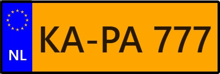

# react-license-plate

A simple React component that visualizes a european (for now) license plate with the flag, country code and license plate number (id).

## How to use

`npm install react-license-plate`

You can now import `react-license-plate` like so:

```js
import LicensePlate from 'react-license-plate'
...
```

## Available props

```ts
interface ILicensePlateProps {
  plateColor?: string;
  countryCode: string;
  countryCodeColor?: string;
  plateId: string;
  height: number;
}
```

| Prop             | Default |             Value |
| ---------------- | :-----: | ----------------: |
| plateColor       |  #fff   |               HEX |
| countryCode      |         | max. 3 characters |
| countryCodeColor |  #fff   |               HEX |
| plateId          |         |              Text |
| height           |         |                px |

## Examples

Code:

```js
<LicensePlate countryCode="D" plateId="KA-PA 777" height={150} />
```

Result:


Code:

```js
<LicensePlate
  plateColor="orange"
  countryCode="NL"
  plateId="KA-PA 777"
  height={150}
/>
```

Result:


